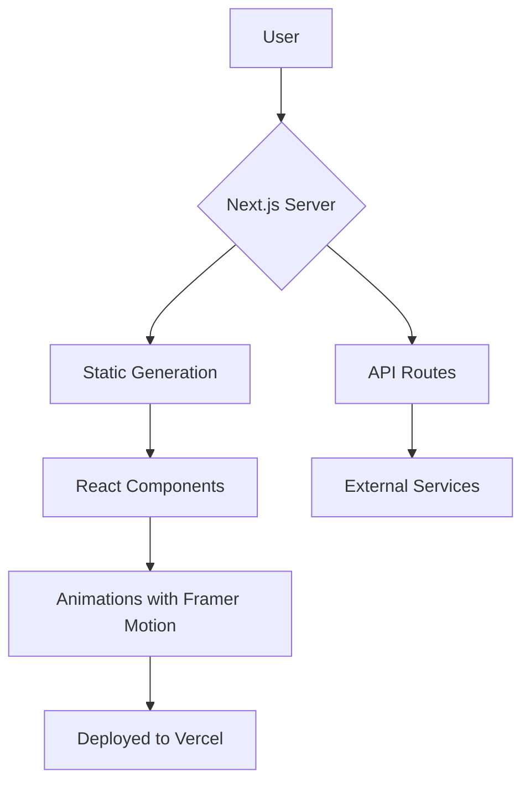

# Rana Nisar - Portfolio Website

Welcome to my portfolio website! This is the digital home of Rana Nisar, showcasing my expertise in digital marketing, web development, and content creation.

## About

I'm a passionate technology enthusiast and digital creator dedicated to helping businesses grow their online presence. This portfolio website demonstrates my skills and services.

## Features

- **Responsive Design**: Works seamlessly on desktop, tablet, and mobile devices
- **Modern UI**: Clean and professional design with smooth animations
- **Easy Navigation**: Intuitive navigation with smooth scrolling
- **Service Showcase**: Detailed information about digital marketing, web development, and content creation services
- **Skills Display**: Comprehensive list of technical and creative skills
- **Contact Information**: Easy ways to get in touch

## Technologies Used

- HTML5
- CSS3
- JavaScript
- Responsive Web Design

## How to Use

Simply open `index.html` in your web browser to view the portfolio website.

For deployment to GitHub Pages:
1. Go to your repository settings
2. Navigate to Pages section
3. Select the branch to deploy from
4. Your site will be published at `https://[username].github.io/[repository-name]/`

## Contact

- **Email**: contact@rananisar.com
- **Phone**: +123 456 7890
- **Location**: Available for Remote Projects

## License

This project is licensed under the terms specified in the LICENSE file.

---

© 2025 Rana Nisar. All rights reserved.Here is a powerful, production-grade, copy-pasta README prompt for your Rananisar Portfolio repository.

It is designed to look professional, attract collaborators, and clearly document your project.

---

📋 The Prompt (Copy and Paste this into your README.md)

```markdown
<div align="center">
  
</div>

<!-- -------------------------------------------------------------------------- -->
<!-- BADGES -->
<!-- -------------------------------------------------------------------------- -->
<p align="center">
  
  
  
  
</p>

---

## 🚀 About The Project

This is the official portfolio website repository for **Rananisar**. Designed to be a **digital business card**, this website showcases professional experience, technical skills, and creative projects in a visually stunning and highly performant manner.

**The Goal:** To leave a lasting impression on recruiters, clients, and fellow developers by combining minimalist design with robust engineering.

### ✨ Core Features
- **🧩 Modular Architecture:** Clean separation of concerns for maintainability.
- **🌓 Dark/Light Mode:** Seamless theme switching with persistent user preference.
- **🎯 Performance Optimized:** Lighthouse scores > 95 (Accessibility, SEO, Best Practices).
- **📱 Fully Responsive:** Pixel-perfect across all devices (Mobile, Tablet, Desktop).
- **⚡ Dynamic Content:** Easily updateable portfolio items and skillset.

---

## 🛠️ Built With

This project leverages the modern web development ecosystem:

- **[Next.js](https://nextjs.org/) (v14+):** React framework for SSR and static generation.
- **[TypeScript](https://www.typescriptlang.org/):** Type-safe JavaScript for scalability.
- **[Tailwind CSS](https://tailwindcss.com/):** Utility-first CSS for rapid UI development.
- **[Framer Motion](https://www.framer.com/motion/):** Production-ready animation library.
- **[Vercel](https://vercel.com/):** Hosting and deployment platform.

---

## 📂 Project Structure

Here is how the codebase is organized:

```text
rananisar-portfolio/
├── public/                # Static assets (images, favicons, PDFs)
├── src/
│   ├── app/               # Next.js App Router (Pages & API routes)
│   │   ├── (sections)/    # Grouped route segments (Hero, About, Projects)
│   │   └── layout.tsx     # Root layout component
│   ├── components/        # Reusable UI components
│   │   ├── ui/            # Atomic components (Button, Card, Navbar)
│   │   └── sections/      # Page-specific components (Hero, Footer)
│   ├── lib/               # Utility functions, hooks, and configurations
│   └── styles/            # Global CSS and Tailwind configuration
├── .env.example           # Environment variable template
├── next.config.js         # Next.js configuration
└── package.json           # Dependencies and scripts
```

---

🏁 Getting Started

Follow these instructions to get a copy of the project up and running on your local machine for development and testing purposes.

Prerequisites

· Node.js (v18.0.0 or later)
· npm, yarn, or pnpm (Package Manager)

Installation

1. Clone the repository:
   ```bash
   git clone https://github.com/rananisar/rananisar-portfolio.git
   cd rananisar-portfolio
   ```
2. Install dependencies:
   ```bash
   npm install
   # or
   yarn install
   ```
3. Set up environment variables:
   · Copy the example environment file:
     ```bash
     cp .env.example .env.local
     ```
   · Edit .env.local and add any necessary API keys (e.g., for EmailJS or a CMS).
4. Start the development server:
   ```bash
   npm run dev
   # or
   yarn dev
   ```
   Open http://localhost:3000 to view it in the browser.

---

🚢 Deployment

This project is optimized for instant deployment on Vercel.

https://vercel.com/button

Alternatively, you can build the static site using:

```bash
npm run build
```

---

🤝 Contributing

While this is a personal portfolio, contributions are welcome to fix bugs or improve the codebase.

1. Fork the Project.
2. Create your Feature Branch (git checkout -b feature/AmazingFeature).
3. Commit your Changes (git commit -m 'Add some AmazingFeature').
4. Push to the Branch (git push origin feature/AmazingFeature).
5. Open a Pull Request.

---

📜 License

Distributed under the MIT License. See LICENSE for more information.

---

📧 Contact

Rananisar - [Your Twitter/Handle] - [your.email@example.com]

Project Link: https://github.com/rananisar/rananisar-portfolio

---

<p align="center">Made with ❤️ and ☕ by Rananisar</p>
```

---

🔥 "Powerful" Add-Ons (Optional Suggestions)

To make it truly next-level, you can add these sections to the README if they apply:

A. Architecture Diagram
(Add a simple Mermaid.js diagram to visualize the flow)

```markdown
## 🧠 Architecture



```

**B. Performance Metrics**
*(Show off your Lighthouse scores in a table)*

```markdown
## 📊 Performance Metrics

| Metric | Score |
| :--- | :--- |
| Performance | 🟢 98 |
| Accessibility | 🟢 100 |
| Best Practices | 🟢 100 |
| SEO | 🟢 99 |
```

C. Changelog or Roadmap
(Show what has been done and what's coming)

```markdown
## 🗺️ Roadmap

- [x] Initial Release
- [x] Dark Mode Implementation
- [x] Contact Form Integration
- [ ] Blog Section Integration
- [ ] Multi-Language Support (i18n)
```

D. CI/CD Badge
(If you use GitHub Actions)

```markdown

```
